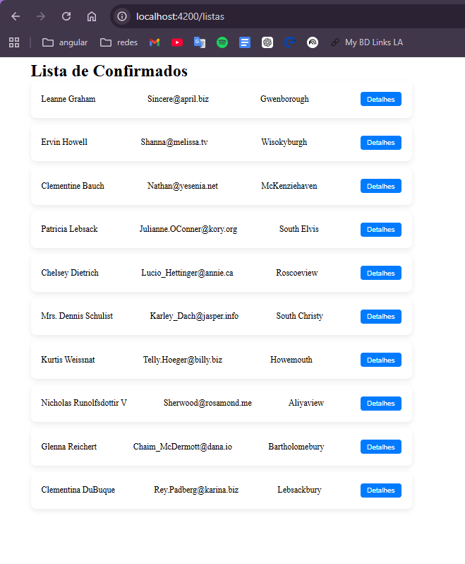
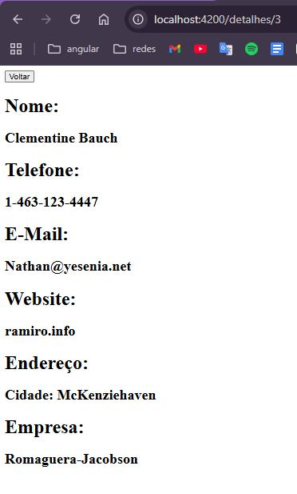

# Projeto Angular

## Perguntas

## O que é uma rota dinâmica?
> Uma rota dinâmica é um caminho de navegação que contém diferentes contéudos de acordo com os parâmetros selecionados.

## O que é o paramMap?
>Um paramMap é uma interface utilizada para acessar os parâmetros das rotas de forma organizada. Ele permite pegar valores enviados pela URL, como um id, por exemplo. No projeto, ele foi usado para obter o id da rota e, a partir dele, buscar as informações do usuário na API.

## Onde você utilizou o Observable e por quê?
>Utilizei no arquivo service - user.ts -, nas funções `getUsers()` e `buscarPorId` que fazem requisições para a API de usuários. Ele foi utilizado porque os dados não chegam imediatamente, por causa do uso do HttpClient. Por isso, os métodos retornam um Observable, permitindo que o componente se inscreva com subscribe() para receber os dados quando a resposta da API estiver disponível.

## Imagens do projeto

